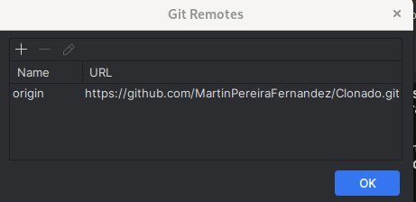

# Hola MUNDIALES.
###  Copiamos el enlace del repositorio que queremos clonar, en este caso es https://github.com/MartinBarreiroVidal/TAREA-REPASO-CLONAR. Crearemos un nuevo proyecto vacio y acto seguido haremos git clone https://github.com/MartinBarreiroVidal/TAREA-REPASO-CLONAR en la terminal de Pycharm. Crearemos un nuevo repositorio vacio en Github y copiaremos su URL para cambiar la URL del original por el del clon  
### Vamos al apartado de Git en PyCharm y modificaremos la URL (origin) y pondremos la URL del nuevo repositorio. Refrescaremos la pagina y saldra el proyecto clonado con todos los commits.